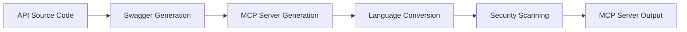

# CodeGlide Documentation

Welcome to CodeGlide - the automated MCP (Model Context Protocol) server generator that transforms your API source code into fully functional MCP servers for AI agents.

## What is CodeGlide?

CodeGlide is a code generation tool that automatically creates MCP servers from your existing API source code. It enables AI agents to interact with your APIs through standardized function calls, making your services AI-agent ready with minimal effort.

### Key Features

**Automated Generation**: Convert API source code to MCP servers automatically  
**Security First**: Built-in security scanning with GitLeaks  
**Multi-Language Support**: Supports multiple programming languages  
**GitHub Actions Ready**: Use directly in your CI/CD workflows  

## Quick Start

### Using GitHub Actions

Add CodeGlide to your workflow in `.github/workflows/generate-mcp.yml`:

```yaml
name: Generate MCP Server
on:
  workflow_dispatch:
    inputs:
      input_directory:
        description: 'Directory containing API source code'
        required: false
        default: '.'

jobs:
  generate:
    runs-on: ubuntu-latest
    steps:
    - uses: actions/checkout@v4
    - name: Generate MCP Server
      uses: CodeGlide/mcp-gen@v1.0.0
      with:
        input_directory: ${{ inputs.input_directory || '.' }}
```

## How It Works



1. **Source Analysis**: CodeGlide analyzes your API source code
2. **Swagger Generation**: Creates comprehensive API documentation
3. **MCP Generation**: Transforms swagger into MCP server code
4. **Language Conversion**: Converts to your target programming language
5. **Security Scanning**: Validates generated code for security issues
6. **Output**: Produces a ready-to-deploy MCP server

## Community & Support

- **Issues**: [GitHub Issues](https://github.com/CodeGlide/mcp-gen/issues)
- **Discussions**: [GitHub Discussions](https://github.com/CodeGlide/mcp-gen/discussions)

---

**Ready to make your APIs AI-agent ready?** Start with our [Getting Started Guide](./getting-started.md)! 
